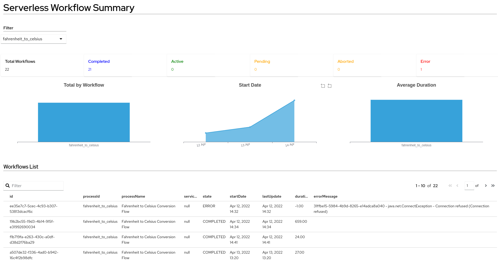

{#include partials/doc/doc-attributes.adoc/}

= {page.title}

== Welcome

MelViz is a tool for creating dashboards and data visualizations for developers and non-technical users. Dashboards can be created using pure `YAML` or you can reuse some of the existing dashboards to monitor your service or application.

Melviz is a https://www.dashbuilder.org/[Dashbuilder] fork.

