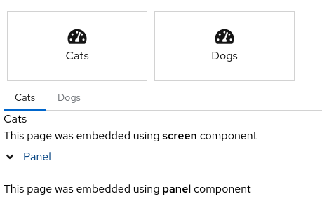

{#include partials/doc/doc-attributes.adoc/}

= {page.title}

In this section we explore the concepts used by MelViz.

== Pages
Pages is where the data visualization lives. It follows a grid approach for organizing the visualization which means that it is organized in rows, columns and components; columns can have their own rows and columns. It is also possible to modify the CSS properties of each page part.

== Navigation
Navigation is an optional component and it is about the relationship between pages. When you have more than one page then a menu is displayed with all pages, you can organize this menu. Furthermore, navigation is the key for embedding pages inside each other.

== Datasets
DataSets are the source of your data. It can come from any JSON/CSV accessible file or you can declare it inline for a static dataset.

More than loading from a source of data, MelViz datasets can be cached and later be spliced, filtered, ordered and grouped for a specific visualization.

== Components
Components are the front ends for static content, data visualization or a navigation component:

- Static components are used for visualization that does not require a dataset. Examples are HTML and forms.
- Data Visualization components are offered natively by MelViz and they can be charts, filters or text that shows some aggregate information from the dataset. 

Supported charts are bar, area, line, pie, donut and map.

_Figure 1. Some of native MelViz components_

- Filters can be presented as labels or a drop down selector

_Figure 2. Filter Components_

- The metric component uses HTML and JS templates to show a grouped dataset information

_Figure 3. Metric Components_

- Navigation components allow you to embed other pages using different ways: Tabs, carousel, tiles, menu and tree navigation.

_Figure 4. Navigation Components_

== External Components
External components are like components, but the code used to build it will run in an isolated container (currently an iframe). It means that with external components it is possible to use any web technology to represent a dataset, users just know how to use the https://blog.kie.org/2021/02/dashbuilder-external-components-javascript-api-2.html[external components Javascript API].